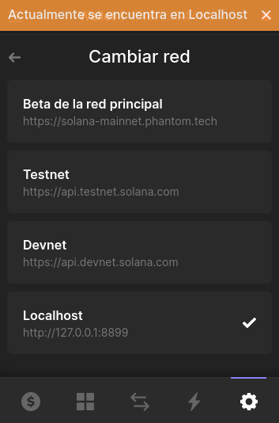

El objetivo de este artículo es proveer una guía completamente en español de cómo construir una aplicación descentralizada (dapp) en la cadena de bloques de Solana. En principio los voy a introducir en el ecosistema de herramientas más comunes para desarrollar en este Blockchain. Espero que el contenido que voy a presentar sea de su agrado y logren desarrollar sus propias aplicaciones. 

## Una sugerencia acerca del desarrollo de dapps con Solana

Antes de comenzar es importante señalar que el ecosistema de Solana es relativamente joven y que muchas de la herramientas que se emplean para el desarrollo se está constantemente actualizando, por lo que muchas veces la documentación oficial muchas veces no está actualizada, asi que mi recomendación es unirse a las comunidades del proyecto y en caso de tener dificultades para desarrollar sus productos, allí puedes encontrar respuesta a tus preguntas en conversaciones, además de participar dde las discusiones del comunidad. A continuación les dejo algunos de los canales de discord que me han sido de mucha utilidad:

1. [Anchor](https://discord.gg/ZCHmqvXgDw)

## Introducción a las herramientas del ecosistema de Solana

La herramientas que vamos a incluir en este artículo son:

1. [Solana Tool Suite](https://docs.solana.com/cli/install-solana-cli-tools) - Esta es la CLI de Solana. La documentación es muy completa y allí encontrarán todos los detalles para aprender a utilizarla. A la fecha de escribir este artículo, yo estaba utilizando la version 1.8.16.
2. [Anchor Framework](https://project-serum.github.io/anchor/getting-started/introduction.html) - Seguramente si has desarrollado dapps sobre Ethereum, habrás utilizado [Hardhat](https://hardhat.org/). Bueno, Anchor es un framework parecido a Hardhat que se utiliza para desarrollar dapps sobre Solana. La versión que utilzaré para este artículo sera la 0.21.0.
3. [solana/web3.js](https://solana-labs.github.io/solana-web3.js/) - Es una version de [web3.js](https://web3js.readthedocs.io/) para solona, sin embargo la documentación no es muy buena, así que si tienes dificultades con ellas busques apoyo en las comunidades de discord. 
4. [React.js](https://reactjs.org/) - Framework para el desarrollo de Front-end. Bastante popular y con muy buena documentación.

En artículo futuros trataré de explicar en que consiste la tecnología Blockchain y cuáles son las características principales de Solana. Por ahora solo nos centraremos en construir un ejemplo que sirva de ilustración para entender cómo desarrollar una dapp sobre Solana.

Si quieres aprender más sobre Solana y cómo funciona, aquí hay algunos artículos muy buenos:

1. [Documentación oficial de Solana](https://docs.solana.com/introduction).
2. [ok so what the fuck is the deal with solana anyway an introduction to the solana blockchain](https://2501babe.github.io/posts/solana101.html).
3. [Solana Summer](https://www.notboring.co/p/solana-summer?s=r).

*** Hacer una breve descripción del proyecto que vamos a construir.

## Prerequisitos

A continuación, enumeraré las dependencias y enlazaré con la documentación para instalarlas, ya que cada proyecto explica y tiene documentado estas cosas mejor de lo que yo podría, además de mantenerlas actualizadas.

1. Node.js - Yo recomiendo utilizar la version 16.04. Para instalarla pueden usar [nvm](https://github.com/nvm-sh/nvm).
2. Solana Tool Suite. La instrucciones de instalación se encuentran en la documentación oficial de [Solana](https://docs.solana.com/cli/install-solana-cli-tools). Yo estoy usando actualmente el sistema operativo Manjaro.
3. Anchor (incluyendo la instalación de [Mocha](https://project-serum.github.io/anchor/getting-started/installation.html#install-mocha)) - La instrucciones de instalación se encuentran [aqui](https://project-serum.github.io/anchor/getting-started/installation.html).
4. Solana browser wallet - Te recomiendo usar [Phantom](https://project-serum.github.io/anchor/getting-started/installation.html). En el desarrollo de nuestro proyecto vamos a probarlo utilizando esta wallet.

## Solana CLI

Las principales cosas que haremos con el CLI de Solana serán configurar nuestra red (entre localhost y una red de prueba para desarrolladores) así como lanzar tokens a nuestras carteras, prácticamente todo lo demás lo haremos con el CLI de Anchor.

Por ejemplo, podemos comprobar la configuración actual de la red (y otras) con este comando:

```shell
solana config get

#output
Config File: /home/user/.config/solana/cli/config.yml
RPC URL: https://api.devnet.solana.com 
WebSocket URL: wss://api.devnet.solana.com/ (computed)
Keypair Path: /home/user/.config/solana/devnet.json 
Commitment: confirmed 
```

Si no tiene una ruta de acceso a Keypair, configure una siguiendo las instrucciones [aquí](https://docs.solana.com/wallet-guide/paper-wallet#seed-phrase-generation).


Para utilizar las redes  localhost, devnet o mainnet, podemos hacer lo siguiente:

```shell
# set to localhost 
solana config set --url localhost

# set config devnet
solana config set --url devnet

# set config mainnet
solana config set --url mainnet

# Output
Config File: /home/user/.config/solana/cli/config.yml
RPC URL: https://api.devnet.solana.com 
WebSocket URL: wss://api.devnet.solana.com/ (computed)
Keypair Path: /home/user/.config/solana/devnet.json 
Commitment: confirmed 
```
Esto es importante ya que es importante estar al tanto de qué red estás usando mientras construyes, pruebas y despliegas tus programas. Asegurate de que tu cartera está usando la misma red que tu entorno local. Vamos a desarrollar nuestra aplicación en la red de devnet, para esto ejecutamos:

```shell
# set config devnet
solana config set --url devnet
```

También podemos usar el CLI para ver la dirección de nuestro monedero local actual:

```shell
solana address

# Output is something like this:
4aDSG82CdgMwt81z7AwnLnDRZyp6MjvZMUVpT82HZRU9
```

Para obtener la información completa de la cuenta:
```shell
solana account «YOUR ADDRESS»

# Output is something like this:
Public Key: 4aDSG82CdgMwt81z7AwnLnDRZyp6MjvZMUVpT82HZRU9
Balance: 4.956381584 SOL
Owner: 11111111111111111111111111111111
Executable: false
Rent Epoch: 277
```

A continuación vamos a conseguir algo de Solana, para hacer esto, asegurate de que te encuentras en la devnet, ya que nuestra dapp va funcionar en esta red. Para conseguir solanas hacemos:

```shell
solana airdrop 2 4aDSG82CdgMwt81z7AwnLnDRZyp6MjvZMUVpT82HZRU9 --url devnet

# Output is something like this:
Requesting airdrop of 2 SOL

Signature: 3KsFBCULmso5Lc7CAQdqF8rzsBXb3xaVrG3cup19n3P2paw3ryvovWQ9MsMB8GMiQkXJWyHXGrni63BsNrxVfHP2

2 SOL
```

Si deseas trabajar con la red en localhost, primero deberás inicial el nodo local de Solana para realizar la pruebas:

```shell
solana-test-validator

#Output is something like this:
Ledger location: test-ledger
Log: test-ledger/validator.log
Identity: D2tKzcNv1iLwWpQpEhwSXvuPH5vQUXy8jwCYvGEUzgZv
Genesis Hash: 3qied4BanGash7eNA46H3UwnP3VLa96gYnMtDgEdQK3T
Version: 1.8.16
Shred Version: 38112
Gossip Address: 127.0.0.1:1024
TPU Address: 127.0.0.1:1027
JSON RPC URL: http://127.0.0.1:8899
.....
```
Y luego

```shell
solana airdrop 2 4aDSG82CdgMwt81z7AwnLnDRZyp6MjvZMUVpT82HZRU9 --url localhost

# Output is something like this:
Requesting airdrop of 1 SOL

Signature: 3KsFBCULmso5Lc7CAQdqF8rzsBXb3xaVrG3cup19n3P2paw3ryvovWQ9MsMB8GMiQkXJWyHXGrni63BsNrxVfHP2

1 SOL
```

Para verificar el balance de nuestro monedero hacemos:

```shell
solana balance «YOUR ADDRESS»
```

Ahora que ya tienes solanas en tu monedero, podemos continuar con la siguiente fase de nuestro proyecto.

## Empezando a construir una dapp con Anchor

Para iniciar, creamos un nuevo proyecto de Anchor y cambiamos al nuevo directorio:

```shell 
anchor init mydapp --javascript
cd mydapp

# Output is something like this:
yarn install v1.22.17
warning package.json: No license field
info No lockfile found.
warning No license field
[1/4] Resolving packages...
warning @project-serum/anchor > @solana/web3.js > rpc-websockets > circular-json@0.5.9: CircularJSON is in maintenance only, flatted is its successor.
[2/4] Fetching packages...
[3/4] Linking dependencies...
warning " > ts-mocha@8.0.0" has incorrect peer dependency "mocha@^3.X.X || ^4.X.X || ^5.X.X || ^6.X.X || ^7.X.X || ^8.X.X".
[4/4] Building fresh packages...
success Saved lockfile.
Done in 11.66s.
mydapp initialized
```

Si deseamos trabajar con Typescript escribimos solamente:

```shell 
anchor init mydapp
cd mydapp

# Output is something like this:
yarn install v1.22.17
warning package.json: No license field
info No lockfile found.
warning No license field
[1/4] Resolving packages...
warning @project-serum/anchor > @solana/web3.js > rpc-websockets > circular-json@0.5.9: CircularJSON is in maintenance only, flatted is its successor.
[2/4] Fetching packages...
[3/4] Linking dependencies...
warning " > ts-mocha@8.0.0" has incorrect peer dependency "mocha@^3.X.X || ^4.X.X || ^5.X.X || ^6.X.X || ^7.X.X || ^8.X.X".
[4/4] Building fresh packages...
success Saved lockfile.
Done in 11.66s.
mydapp initialized
```

Como podrás comprobar, este comando creo la siguiente estructura de archivos:

```shell
tree -L 1

# Output is something like this:
.
├── Anchor.toml
├── app
├── Cargo.toml
├── migrations
├── node_modules
├── package.json
├── programs
├── tests
├── tsconfig.json
└── yarn.lock

5 directories, 5 files
```

Como se puede apreciar hay cuatro directorios a resaltar:

**app** - Este directorio se utilizará para alojar el frontend de la aplicación.

**programs** - Aquí se alojan los programas codificados en Rust. Estos son los archivos que defines los programas sobre la blockchain de Solana.

**test** - En este directorio de alojan las pruebas para cada unas de las funcionalidades de nuestra dapp.

**migrations** - Contiene todos los scripts necesarios para el despliegue de la dapp.

Echemos un vistazo al programa que se creó para nosotros.

Anchor utiliza, y nos permite escribir, un eDSL (DSL embebido) que abstrae muchas de las operaciones de bajo nivel más complejas que normalmente tendrías que hacer si estuvieras usando Solana y Rust sin él, haciéndolo más accesible.

```rust 
use anchor_lang::prelude::*;

declare_id!("Fg6PaFpoGXkYsidMpWTK6W2BeZ7FEfcYkg476zPFsLnS");

#[program]
pub mod mydapp {
    use super::*;
    pub fn initialize(ctx: Context<Initialize>) -> ProgramResult {
        Ok(())
    }
}

#[derive(Accounts)]
pub struct Initialize {}
```

Este es probablemente el programa más básico que puedes escribir. Lo único que sucede aquí es que estamos definiendo una función llamada `initialize`, que cuando se invoca simplemente sale del programa con éxito. No hay ninguna manipulación de datos.

La estructura `Initialize` define el contexto como vacío de cualquier argumento. Aprenderemos más sobre el contexto de la función más adelante.

Para compilar este programa, podemos ejecutar el comando Anchor build:

```shell
anchor build

# Output is something like this:
BPF SDK: /home/alejandro/.local/share/solana/install/releases/1.8.16/solana-release/bin/sdk/bpf
cargo-build-bpf child: rustup toolchain list -v
cargo-build-bpf child: cargo +bpf build --target bpfel-unknown-unknown --release
   Compiling proc-macro2 v1.0.36
   Compiling unicode-xid v0.2.2
   Compiling syn v1.0.86
   Compiling serde_derive v1.0.136
   Compiling serde v1.0.136
   Compiling version_check v0.9.4
   Compiling typenum v1.15.0
   Compiling serde_json v1.0.79
   Compiling semver v1.0.6
   Compiling anyhow v1.0.56
   Compiling ryu v1.0.9
   Compiling opaque-debug v0.3.0
   Compiling cfg-if v1.0.0
   Compiling itoa v1.0.1
   Compiling yansi v0.5.0
   Compiling cpufeatures v0.2.1
   Compiling unicode-segmentation v1.9.0
   Compiling bs58 v0.3.1
   Compiling subtle v2.4.1
   Compiling rustversion v1.0.6
   Compiling feature-probe v0.1.1
   Compiling memchr v2.4.1
   Compiling once_cell v1.10.0
   Compiling cc v1.0.73
   Compiling log v0.4.14
   Compiling autocfg v1.1.0
   Compiling bs58 v0.4.0
   Compiling arrayref v0.3.6
   Compiling arrayvec v0.7.2
   Compiling either v1.6.1
   Compiling regex-syntax v0.6.25
   Compiling keccak v0.1.0
   Compiling constant_time_eq v0.1.5
   Compiling lazy_static v1.4.0
   Compiling base64 v0.13.0
   Compiling generic-array v0.14.5
   Compiling proc-macro2-diagnostics v0.9.1
   Compiling ahash v0.7.6
   Compiling heck v0.3.3
   Compiling bv v0.11.1
   Compiling num-traits v0.2.14
   Compiling itertools v0.10.3
   Compiling blake3 v1.3.1
   Compiling rustc_version v0.4.0
   Compiling quote v1.0.15
   Compiling aho-corasick v0.7.18
   Compiling hashbrown v0.11.2
   Compiling solana-frozen-abi-macro v1.10.0
   Compiling solana-frozen-abi v1.10.0
   Compiling solana-program v1.10.0
   Compiling regex v1.5.5
   Compiling borsh-schema-derive-internal v0.9.3
   Compiling borsh-derive-internal v0.9.3
   Compiling thiserror-impl v1.0.30
   Compiling bytemuck_derive v1.0.1
   Compiling solana-sdk-macro v1.10.0
   Compiling num-derive v0.3.3
   Compiling bytemuck v1.8.0
   Compiling thiserror v1.0.30
   Compiling bincode v1.3.3
   Compiling serde_bytes v0.11.5
   Compiling toml v0.5.8
   Compiling block-buffer v0.10.2
   Compiling crypto-common v0.1.3
   Compiling block-buffer v0.9.0
   Compiling digest v0.9.0
   Compiling digest v0.10.3
   Compiling sha2 v0.9.9
   Compiling sha2 v0.10.2
   Compiling sha3 v0.10.1
   Compiling proc-macro-crate v0.1.5
   Compiling anchor-syn v0.21.0
   Compiling borsh-derive v0.9.3
   Compiling borsh v0.9.3
   Compiling anchor-attribute-access-control v0.21.0
   Compiling anchor-attribute-interface v0.21.0
   Compiling anchor-attribute-event v0.21.0
   Compiling anchor-attribute-state v0.21.0
   Compiling anchor-attribute-constant v0.21.0
   Compiling anchor-attribute-account v0.21.0
   Compiling anchor-attribute-error v0.21.0
   Compiling anchor-derive-accounts v0.21.0
   Compiling anchor-attribute-program v0.21.0
   Compiling anchor-lang v0.21.0
   Compiling mydapp v0.1.0 (/home/alejandro/Documentos/Education/Blog/mydapp/programs/mydapp)
warning: unused variable: `ctx`
 --> programs/mydapp/src/lib.rs:8:23
  |
8 |     pub fn initialize(ctx: Context<Initialize>) -> ProgramResult {
  |                       ^^^ help: if this is intentional, prefix it with an underscore: `_ctx`
  |
  = note: `#[warn(unused_variables)]` on by default

warning: `mydapp` (lib) generated 1 warning
    Finished release [optimized] target(s) in 1m 30s
cargo-build-bpf child: /home/alejandro/.local/share/solana/install/releases/1.8.16/solana-release/bin/sdk/bpf/scripts/strip.sh /home/alejandro/Documentos/Education/Blog/mydapp/target/bpfel-unknown-unknown/release/mydapp.so /home/alejandro/Documentos/Education/Blog/mydapp/target/deploy/mydapp.so
cargo-build-bpf child: /home/alejandro/.local/share/solana/install/releases/1.8.16/solana-release/bin/sdk/bpf/dependencies/bpf-tools/llvm/bin/llvm-readelf --dyn-symbols /home/alejandro/Documentos/Education/Blog/mydapp/target/deploy/mydapp.so

To deploy this program:
  $ solana program deploy /home/alejandro/Documentos/Education/Blog/mydapp/target/deploy/mydapp.so
The program address will default to this keypair (override with --program-id):
  /home/alejandro/Documentos/Education/Blog/mydapp/target/deploy/mydapp-keypair.json
```

Una vez que la ejecución se ha completado, deberías ver una nueva carpeta llamada _target_.




Si el anterior paso no te compila correctamente, revisa la versión de Anchor con:
```shell
anchor --version
```
En caso de estar usando  las version Anchor 0.22.0 hay que actualizar el archivo como te muestro a continuación:

```rust 
use anchor_lang::prelude::*;

declare_id!("Fg6PaFpoGXkYsidMpWTK6W2BeZ7FEfcYkg476zPFsLnS");

#[program]
pub mod mydapp {
    use super::*;
    pub fn initialize(ctx: Context<Initialize>) -> Result<()> {
        Ok(())
    }
}

#[derive(Accounts)]
pub struct Initialize {}
```



Uno de los artefactos creados es un IDL ubicado en target/idl/mysolanaapp.json.

Los IDLs son muy similares a un ABI en Solidity (o una definición de consulta en GraphQL), y los usaremos de manera similar en nuestras pruebas y frontends de JavaScript para comunicarnos con nuestro programa Solana vía RPC.

También podemos probar nuestro programa. Si abrimos tests/mysolanaapp.js, veremos que hay un test escrito en JavaScript que nos permite probar el programa.

El test debería tener el siguiente aspecto en javascript:

```javascript
const anchor = require('@project-serum/anchor');

describe('mydapp', () => {

  // Configure the client to use the local cluster.
  anchor.setProvider(anchor.Provider.env());

  it('Is initialized!', async () => {
    // Add your test here.
    const program = anchor.workspace.Mydapp;
    const tx = await program.rpc.initialize();
    console.log("Your transaction signature", tx);
  });
});
```

Para el caso de Typescript:

```typescript
import * as anchor from '@project-serum/anchor';
import { Program } from '@project-serum/anchor';
import { Mydapp } from '../target/types/mydapp';

describe('mydapp', () => {

  // Configure the client to use the local cluster.
  anchor.setProvider(anchor.Provider.env());

  const program = anchor.workspace.Mydapp as Program<Mydapp>;

  it('Is initialized!', async () => {
    // Add your test here.
    const tx = await program.rpc.initialize({});
    console.log("Your transaction signature", tx);
  });
});
```
Hay un par de cosas que aprender de esta prueba que son importantes y que usaremos en el futuro, tanto en nuestras pruebas como en los clientes frontales de JavaScript.

Para llamar a un programa de Solana usando Anchor, típicamente necesitamos dos cosas principales:

1. **Provider** - El proveedor es una abstracción de una conexión a la red Solana, que suele consistir en una conexión, un monedero y un solicitud. En la prueba, el framework de Anchor creará el proveedor por nosotros basándose en el entorno (`anchor.Provider.env()`), pero en el cliente tendremos que construir el proveedor nosotros mismos usando el monedero de Solana del usuario.

2. **Program** -  El programa es una abstracción que combina el `Provider`, `idl`, y el `programID` (que se genera cuando se construye el programa) y nos permite llamar a métodos RPC contra nuestro programa.

Una vez más, como con el proveedor, Anchor ofrece una forma conveniente de acceder al programa, pero cuando se construye el front-end tendremos que construir este proveedor nosotros mismos.

Una vez que tenemos estas dos cosas, podemos empezar a llamar a funciones en nuestro programa. Por ejemplo, en nuestro programa tenemos una función de `initialize`. En nuestra prueba, verás que podemos invocar esa función directamente usando `program.rpc.functionName`:

```javascript
const tx = await program.rpc.initialize();
```

Este es un patrón muy común que usarás mucho cuando trabajes con Anchor, y una vez que entiendas cómo funciona, hace que sea realmente fácil conectarse e interactuar con un programa de Solana.

Ahora podemos probar el programa ejecutando el script de prueba:

```shell
anchor test

#Output is something like this:
BPF SDK: /home/alejandro/.local/share/solana/install/releases/1.8.16/solana-release/bin/sdk/bpf
cargo-build-bpf child: rustup toolchain list -v
cargo-build-bpf child: cargo +bpf build --target bpfel-unknown-unknown --release
warning: unused variable: `ctx`
 --> programs/mydapp/src/lib.rs:8:23
  |
8 |     pub fn initialize(ctx: Context<Initialize>) -> ProgramResult {
  |                       ^^^ help: if this is intentional, prefix it with an underscore: `_ctx`
  |
  = note: `#[warn(unused_variables)]` on by default

warning: `mydapp` (lib) generated 1 warning
    Finished release [optimized] target(s) in 0.21s
cargo-build-bpf child: /home/alejandro/.local/share/solana/install/releases/1.8.16/solana-release/bin/sdk/bpf/dependencies/bpf-tools/llvm/bin/llvm-readelf --dyn-symbols /home/alejandro/Documentos/Education/Blog/mydapp/target/deploy/mydapp.so

To deploy this program:
  $ solana program deploy /home/alejandro/Documentos/Education/Blog/mydapp/target/deploy/mydapp.so
The program address will default to this keypair (override with --program-id):
  /home/alejandro/Documentos/Education/Blog/mydapp/target/deploy/mydapp-keypair.json
yarn run v1.22.17
warning package.json: No license field
$ /home/alejandro/Documentos/Education/Blog/mydapp/node_modules/.bin/ts-mocha -p ./tsconfig.json -t 1000000 'tests/**/*.ts'


  mydapp
Your transaction signature oEboPaKA1Y6t8UT3CVpvgcPquoy7fizKedyg7Hr8PF6vD2EH3GmoCCqczEVLwH9HzvGxsJ7Uc2uuL3qhvgJx5Ag
    ✔ Is initialized! (370ms)


  1 passing (376ms)

Done in 6.31s.

```

## Hello World
Ahora que tenemos nuestro proyecto configurado, vamos a crear algo un poco más interesante.

Sé que, como desarrollador full stack, la mayoría de las veces me pregunto cómo hacer operaciones del tipo CRUD, así que eso es lo que veremos a continuación.

El primer programa que crearemos nos permitirá crear un contador que se incremente cada vez que lo llamemos desde una aplicación cliente.

Lo primero que debemos hacer es abrir `programs/mysolanaapp/src/lib.rs` y actualizarlo con el siguiente código:

```rust
use anchor_lang::prelude::*;

declare_id!("Fg6PaFpoGXkYsidMpWTK6W2BeZ7FEfcYkg476zPFsLnS");

#[program]
mod mydapp {
    use super::*;

    pub fn create(ctx: Context<Create>) -> ProgramResult {
        let base_account = &mut ctx.accounts.base_account;
        base_account.count = 0;
        Ok(())
    }

    pub fn increment(ctx: Context<Increment>) -> ProgramResult {
        let base_account = &mut ctx.accounts.base_account;
        base_account.count += 1;
        Ok(())
    }
}

// Transaction instructions
#[derive(Accounts)]
pub struct Create<'info> {
    #[account(init, payer = user, space = 16 + 16)]
    pub base_account: Account<'info, BaseAccount>,
    #[account(mut)]
    pub user: Signer<'info>,
    pub system_program: Program <'info, System>,
}

// Transaction instructions
#[derive(Accounts)]
pub struct Increment<'info> {
    #[account(mut)]
    pub base_account: Account<'info, BaseAccount>,
}

// An account that goes inside a transaction instruction
#[account]
pub struct BaseAccount {
    pub count: u64,
}
```


Recuerda que si estás usando Anchor 0.22.0 o superior debes remplazar `ProgramResult` por `Result<()>`.


En este programa tenemos dos funciones - `create` e `increment`. Estas dos funciones son los manejadores de peticiones RPC que podremos llamar desde una aplicación cliente para interactuar con el programa.

El primer parámetro de un manejador RPC es la estructura `Context`, que describe el contexto que se pasará cuando se llame a la función y cómo manejarlo. En el caso de `Create`, se esperan tres parámetros: `base_account`, `user`, y `system_program`.

Los atributos #[account(...)] definen las restricciones e instrucciones que están relacionadas con la cuenta de origen donde se declara. Si alguna de estas restricciones no se mantiene, entonces la instrucción nunca se ejecutará.

Cualquier cliente que llame a este programa con la `base_account` adecuada puede llamar a estos métodos RPC.

La forma en que Solana maneja los datos es muy diferente a cualquier cosa con la que haya trabajado. No hay un estado persistente dentro del programa, todo se adjunta a lo que se conoce como cuentas. Una cuenta contiene esencialmente todo el estado de un programa. Debido a esto, todos los datos se pasan por referencia desde el exterior.

Tampoco hay operaciones de lectura. Esto se debe a que todo lo que necesitas hacer para leer el contenido de un programa es solicitar la cuenta, a partir de ahí eres capaz de ver todo el estado del programa. Para leer más sobre el funcionamiento de las cuentas, consulta este [post](https://2501babe.github.io/posts/solana101.html#programs-and-accounts).

Para construir el programa:

```
anchor build

# Output is something like this:
BPF SDK: /home/alejandro/.local/share/solana/install/releases/1.8.16/solana-release/bin/sdk/bpf
cargo-build-bpf child: rustup toolchain list -v
cargo-build-bpf child: cargo +bpf build --target bpfel-unknown-unknown --release
   Compiling mydapp2 v0.1.0 (/home/alejandro/Documentos/Education/Blog/mydapp2/programs/mydapp2)
    Finished release [optimized] target(s) in 1.07s
cargo-build-bpf child: /home/alejandro/.local/share/solana/install/releases/1.8.16/solana-release/bin/sdk/bpf/scripts/strip.sh /home/alejandro/Documentos/Education/Blog/mydapp2/target/bpfel-unknown-unknown/release/mydapp2.so /home/alejandro/Documentos/Education/Blog/mydapp2/target/deploy/mydapp2.so
cargo-build-bpf child: /home/alejandro/.local/share/solana/install/releases/1.8.16/solana-release/bin/sdk/bpf/dependencies/bpf-tools/llvm/bin/llvm-readelf --dyn-symbols /home/alejandro/Documentos/Education/Blog/mydapp2/target/deploy/mydapp2.so

To deploy this program:
  $ solana program deploy /home/alejandro/Documentos/Education/Blog/mydapp2/target/deploy/mydapp2.so
The program address will default to this keypair (override with --program-id):
  /home/alejandro/Documentos/Education/Blog/mydapp2/target/deploy/mydapp2-keypair.json

```

A continuación, vamos a escribir un test que utilice este programa contador. Para ello, abre ```tests/mysolanaapp.js``` y actualízalo con el siguiente código:

```javascript
const assert = require("assert");
const anchor = require("@project-serum/anchor");
const { SystemProgram } = anchor.web3;

describe("mydapp", () => {
  /* create and set a Provider */
  const provider = anchor.Provider.env();
  anchor.setProvider(provider);
  const program = anchor.workspace.Mydapp;
  it("Creates a counter)", async () => {
    /* Call the create function via RPC */
    const baseAccount = anchor.web3.Keypair.generate();
    await program.rpc.create({
      accounts: {
        baseAccount: baseAccount.publicKey,
        user: provider.wallet.publicKey,
        systemProgram: SystemProgram.programId,
      },
      signers: [baseAccount],
    });

    /* Fetch the account and check the value of count */
    const account = await program.account.baseAccount.fetch(baseAccount.publicKey);
    console.log('Count 0: ', account.count.toString())
    assert.ok(account.count.toString() == 0);
    _baseAccount = baseAccount;

  });

  it("Increments the counter", async () => {
    const baseAccount = _baseAccount;

    await program.rpc.increment({
      accounts: {
        baseAccount: baseAccount.publicKey,
      },
    });

    const account = await program.account.baseAccount.fetch(baseAccount.publicKey);
    console.log('Count 1: ', account.count.toString())
    assert.ok(account.count.toString() == 1);
  });
});
```

Antes de continuar probando y desplegando el programa, queremos obtener el ID del programa generado dinámicamente por la compilación. Necesitamos este ID para usarlo en el programa de Rust para reemplazar el ID del marcador de posición que establecimos cuando creamos el proyecto. Para obtener este ID, podemos ejecutar el siguiente comando:

```shell
solana address -k target/deploy/mydapp-keypair.json

# Output is something like this:
3L2Pintorca7FYFPRpKrgWojyfCMP3btASnM4w3kpZbs
```

Ahora podemos actualizar los ID de los programas en `lib.rs`:

```rust 
// mysolanaapp/src/lib.rs

declare_id!("your-program-id");
```

y también en el archivo `Anchor.toml`

```toml
[features]
seeds = false
[programs.localnet]
mydapp2 = "3L2Pintorca7FYFPRpKrgWojyfCMP3btASnM4w3kpZbs"
```

Luego ejecutamos:
```shell
anchor test

# Output is something like this:
BPF SDK: /home/alejandro/.local/share/solana/install/releases/1.8.16/solana-release/bin/sdk/bpf
cargo-build-bpf child: rustup toolchain list -v
cargo-build-bpf child: cargo +bpf build --target bpfel-unknown-unknown --release
    Finished release [optimized] target(s) in 0.18s
cargo-build-bpf child: /home/alejandro/.local/share/solana/install/releases/1.8.16/solana-release/bin/sdk/bpf/dependencies/bpf-tools/llvm/bin/llvm-readelf --dyn-symbols /home/alejandro/Documentos/Education/Blog/mydapp2/target/deploy/mydapp2.so

To deploy this program:
  $ solana program deploy /home/alejandro/Documentos/Education/Blog/mydapp2/target/deploy/mydapp2.so
The program address will default to this keypair (override with --program-id):
  /home/alejandro/Documentos/Education/Blog/mydapp2/target/deploy/mydapp2-keypair.json
yarn run v1.22.17
warning package.json: No license field
$ /home/alejandro/Documentos/Education/Blog/mydapp2/node_modules/.bin/mocha -t 1000000 tests/


  mydapp2
Count 0:  0
    ✔ Creates a counter) (238ms)
Count 1:  1
    ✔ Increments the counter (419ms)


  2 passing (663ms)

Done in 6.15s.
```


En ocasiones la ejecución de las pruebas falla porque el nodo de pruebas está activo. Verifica que `solana-test-validator` no esté corriendo, si es así termina el proceso y vuelve a ejecutar las pruebas.


Una vez que la prueba pasa, ahora podemos desplegar.

Ahora podemos desplegar, asegurate de que `solana-test-validator` se está ejecutando:

```shell
anchor deploy

# Output is something like this:
Deploying workspace: http://localhost:8899
Upgrade authority: /home/alejandro/.config/solana/id.json
Deploying program "mydapp"...
Program path: /home/alejandro/Documentos/Education/Blog/mydapp/target/deploy/mydapp.so...
Program Id: CdhMsArvZhsPzEt5LYc55TZeScg1RNGUfXExtayB6vUA

Deploy success
```

Tambien se puede ver el registro del validador abriendo una ventana separada y ejecutando `solana logs`.


Ya estamos listos para construir el frontend.

## Construyento la React App

En la raíz del proyecto Anchor, crea una nueva react app para sobrescribir el directorio de la app existente:

```shell
create-react-app app
```

El siguiente paso es instalar la dependencias que vamos a necesitar para Anchor y Solana Web3:
```
cd app
yarn add @project-serum/anchor @solana/web3.js
```

También vamos a utilizar [Solana Wallet Adapter](https://github.com/solana-labs/wallet-adapter) para controlar las conexiones de la monederos de los usuarios de solana. Para esto hacemos:

```shell
yarn add @solana/wallet-adapter-react @solana/wallet-adapter-react-ui @solana/wallet-adapter-wallets @solana/wallet-adapter-base
```

A continuación, en el directorio `src`, crea un nuevo archivo llamado `idl.json`. Aquí, copie el IDL JSON que fue creado para usted en la carpeta principal del proyecto, ubicado en  `target/idl/mydapp.json`.

Sería bueno si pudiéramos copiar este archivo idl automáticamente a nuestra carpeta src de la aplicación cliente, pero hasta ahora no he encontrado una manera de hacer esto de forma nativa. Por supuesto, puedes crear tu propio script que haga esto si lo deseas, o bien necesitas copiar y pegar sobre el IDL después de cada cambio en tu programa principal.

Si quieres un script como este, puedes hacerlo en sólo un par de líneas de código:

```javascript
//copyIdl.js
const fs = require('fs');
const idl = require('./target/idl/mysolanaapp.json');

fs.writeFileSync('./app/src/idl.json', JSON.stringify(idl));
```

A continuación, abre app/src/App.js y actualízalo con lo siguiente:

```javascript
import './App.css';
import { useState } from 'react';
import { Connection, PublicKey } from '@solana/web3.js';
import {
  Program, Provider, web3
} from '@project-serum/anchor';
import idl from './idl.json';

import { PhantomWalletAdapter } from '@solana/wallet-adapter-wallets';
import { useWallet, WalletProvider, ConnectionProvider } from '@solana/wallet-adapter-react';
import { WalletModalProvider, WalletMultiButton } from '@solana/wallet-adapter-react-ui';
require('@solana/wallet-adapter-react-ui/styles.css');

const wallets = [
  /* view list of available wallets at https://github.com/solana-labs/wallet-adapter#wallets */
  new PhantomWalletAdapter()
]

const { SystemProgram, Keypair } = web3;
/* create an account  */
const baseAccount = Keypair.generate();
const opts = {
  preflightCommitment: "processed"
}
const programID = new PublicKey(idl.metadata.address);

function App() {
  const [value, setValue] = useState(null);
  const wallet = useWallet();

  async function getProvider() {
    /* create the provider and return it to the caller */
    /* network set to local network for now */
    const network = "http://127.0.0.1:8899";
    const connection = new Connection(network, opts.preflightCommitment);

    const provider = new Provider(
      connection, wallet, opts.preflightCommitment,
    );
    return provider;
  }

  async function createCounter() {    
    const provider = await getProvider()
    /* create the program interface combining the idl, program ID, and provider */
    const program = new Program(idl, programID, provider);
    try {
      /* interact with the program via rpc */
      await program.rpc.create({
        accounts: {
          baseAccount: baseAccount.publicKey,
          user: provider.wallet.publicKey,
          systemProgram: SystemProgram.programId,
        },
        signers: [baseAccount]
      });

      const account = await program.account.baseAccount.fetch(baseAccount.publicKey);
      console.log('account: ', account);
      setValue(account.count.toString());
    } catch (err) {
      console.log("Transaction error: ", err);
    }
  }

  async function increment() {
    const provider = await getProvider();
    const program = new Program(idl, programID, provider);
    await program.rpc.increment({
      accounts: {
        baseAccount: baseAccount.publicKey
      }
    });

    const account = await program.account.baseAccount.fetch(baseAccount.publicKey);
    console.log('account: ', account);
    setValue(account.count.toString());
  }

  if (!wallet.connected) {
    /* If the user's wallet is not connected, display connect wallet button. */
    return (
      <div style={{ display: 'flex', justifyContent: 'center', marginTop:'100px' }}>
        <WalletMultiButton />
      </div>
    )
  } else {
    return (
      <div className="App">
        <div>
          {
            !value && (<button onClick={createCounter}>Create counter</button>)
          }
          {
            value && <button onClick={increment}>Increment counter</button>
          }

          {
            value && value >= Number(0) ? (
              <h2>{value}</h2>
            ) : (
              <h3>Please create the counter.</h3>
            )
          }
        </div>
      </div>
    );
  }
}

/* wallet configuration as specified here: https://github.com/solana-labs/wallet-adapter#setup */
const AppWithProvider = () => (
  <ConnectionProvider endpoint="http://127.0.0.1:8899">
    <WalletProvider wallets={wallets} autoConnect>
      <WalletModalProvider>
        <App />
      </WalletModalProvider>
    </WalletProvider>
  </ConnectionProvider>
)

export default AppWithProvider;
```

Finalmente desde el directorio, iniciamos la aplicación de React:

```shell
yarn start
```


Si estas haciendo uso de React.js versión 17.0.0, es posible que tengas problemas con webpack 5. Para resolver esto, te recomiendo hacer lo siguiente:

1. Primero installar las siguientes dependencias:
    ```shell
    yarn add --dev react-app-rewired process crypto-browserify stream-browserify assert stream-http https-browserify os-browserify url buffer
    ```
2. Crear el archivo `config-overrides.js` en la raiz del proyecto de React:
    ```javascript
    const webpack = require('webpack');

    module.exports = function override(config) {
        const fallback = config.resolve.fallback || {};
        Object.assign(fallback, {
            "crypto": require.resolve("crypto-browserify"),
            "stream": require.resolve("stream-browserify"),
            "assert": require.resolve("assert"),
            "http": require.resolve("stream-http"),
            "https": require.resolve("https-browserify"),
            "os": require.resolve("os-browserify"),
            "url": require.resolve("url")
        })
        config.resolve.fallback = fallback;
        config.plugins = (config.plugins || []).concat([
            new webpack.ProvidePlugin({
                process: 'process/browser',
                Buffer: ['buffer', 'Buffer']
            })
        ])
        return config;
    }
    ```
3. Luego editar el archivo package.json. En lugar de `react-scripts` remplazar esto por `react-app-rewired`:
   
    Antes:
    ```json
    "scripts": {
        "start": "react-scripts start",
        "build": "react-scripts build",
        "test": "react-scripts test",
        "eject": "react-scripts eject"
    },
    ```
    Luego:
    ```json
    "scripts": {
        "start": "react-app-rewired start",
        "build": "react-app-rewired build",
        "test": "react-app-rewired test",
        "eject": "react-scripts eject"
    },
    ```
Los polyfills de Nodejs que faltan deberían estar incluidos ahora y tu aplicación debería ser funcional con web3.

Si quieres ocultar las advertencias creadas por la consola en `config-overrides.js` en el interior de la función `override`, agrega:
```javascript
config.ignoreWarnings = [/Failed to parse source map/];

Ver documentación de [web3.js.](https://github.com/ChainSafe/web3.js)
```


## Configurar la red local en la Wallet

Antes de poder interactuar con un programa en la red localhost, debemos cambiar nuestro monedero Phantom a la red adecuada.

Para ello, abre tu monedero Phantom y haz clic en el botón de configuración. A continuación, desplácese hacia abajo para cambiar la red:


A continuación, elija Localhost:



Ahora tenemos que enviar tokens por aire a esta cartera. En la parte superior de la interfaz del monedero, haz clic en tu dirección para copiarla en el portapapeles.


A continuación, en una termina ejecutamos el siguiente comando (asegurate que `solana-test-validator` esté corriendo):

```shell
solana airdrop 2 «YOUR_ADDRESS»
```

Ahora deberías tener 2 solanas en tu cartera. Ahora podemos ejecutar y probar la aplicación.

Cambia al directorio de la aplicación y ejecuta el siguiente comando:

```shell
yarn start
```

Deberías poder conectar tu cartera, crear un contador e incrementarlo.

Notarás que cuando refrescas, pierdes el estado del programa. Esto es porque estamos generando dinámicamente la cuenta base cuando el programa se carga. Si quieres leer e interactuar con los datos del programa a través de varios clientes, tendrías que crear y almacenar el Keypair en algún lugar de tu proyecto. He reunido una idea general de un enfoque ingenuo de cómo podría verse esto.


## Despliegue en la Devnet
A partir de aquí, el despliegue en una red activa es bastante sencillo. Las principales cosas que tenemos que hacer son:

1. Actualice la CLI de Solana para utilizar devnet:
   ```shell 
   solana config set --url devnet
   ```
2. 

## Imágenes

  * [Unplash](https://unsplash.com/) - [3D illustration of blocks in a blockchain](https://unsplash.com/photos/_rZnChsIFuQ)
  
    WhatsApp: +917559305753 
    
    Email: shubhamdhage000@gmail.com
## Referencias

1. [Julius Berner. 2021. The Modern Mathematics of deep learning.](https://deepai.org/publication/the-modern-mathematics-of-deep-learning)
2. [Yaser Abu-Mostafa Data. 2012 - 2015. Learning From Data.](https://work.caltech.edu/telecourse)

3. [Web3.js](https://github.com/ChainSafe/web3.js)